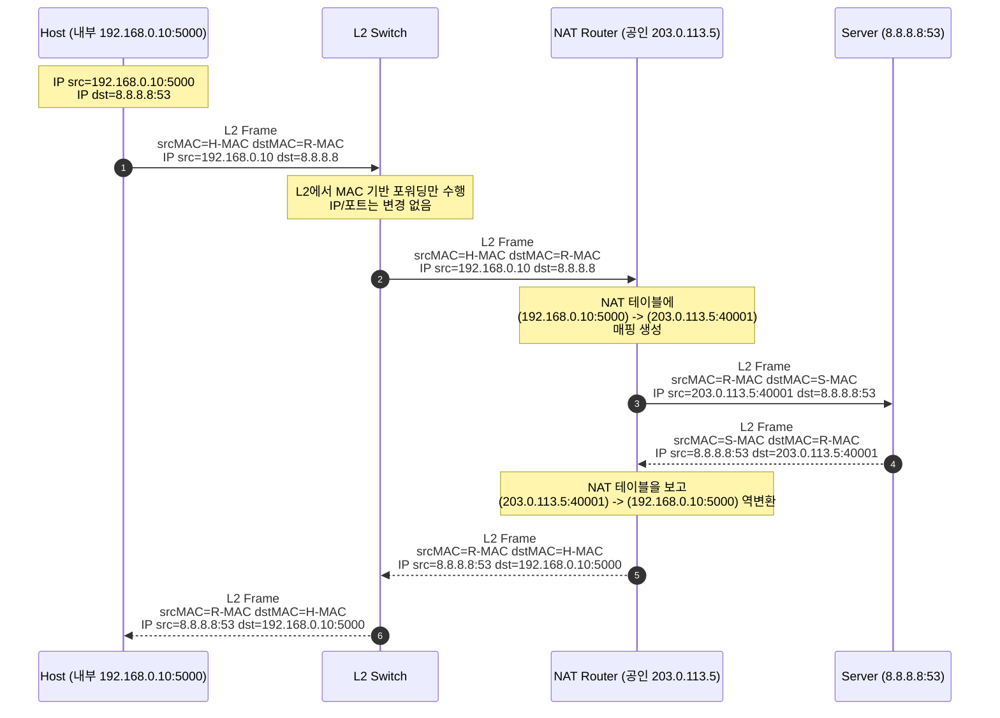
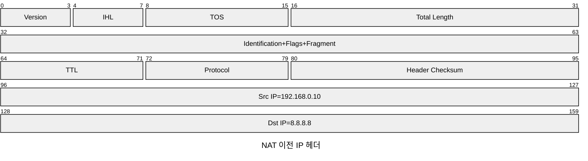
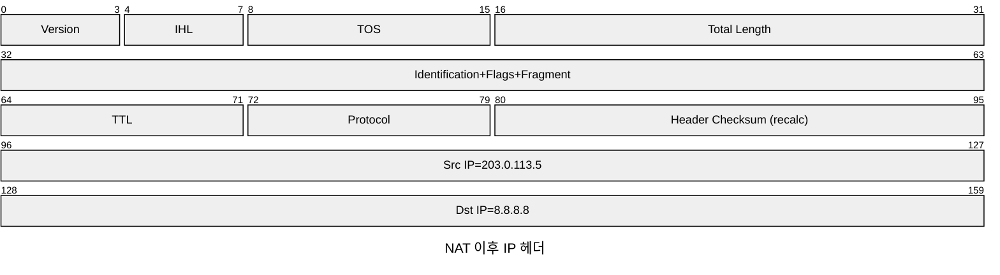

## NAT (Network Address Translation)

NAT란, 라우터가 패킷을 지나가게 하면서 IP 주소를 다른 주소로 바꿔주는 기술로,
IP 주소를 변환해서 프라이빗 네트워크 <-> 외부 네트워크(인터넷)을 중계하는 역할을 한다.

### OSI 계층 관점

- 위치와 역할

NAT는 네트워크 계층(L3)기능으로 분류되며, 라우터나 L3 스위치에서 동작한다.

IP 헤더의 출발지/목적지 주소를 다른 주소로 매핑하여, 사실 IP <-> 공인 IP 번역을 수행한다.

- 어떤 PDU/필드를 건드리나?

L3 PDU(패킷)의 IP 헤더 필드(src/dest IP)를 수정하고, PAT(Port Address Translation)까지 포함하면 L4 헤더의 포트 번호도 함께 매핑한다.

이 과정에서 연결 상태를 NAT 테이블로 유지하여, 외부에서 돌아오는 패킷을 다시 내부 호스트로 되돌릴 수 있게 한다.

- NAT 전/후 패킷 헤더 비교

### 가상 머신에서의 NAT

가상머신에서 네트워크 설정을 NAT로 설정하면, VM이 호스트와는 다른 사설 서브넷에 있고, 호스트가 라우터+NAT 역할을 해서 외부 네트워크에 나간다. 

따라서 VM은 인터넷에 나갈 수 있지만, 외부에서 VM으로 직접 접속하기 위해서는 별도 포트포워딩이 필요하다.
