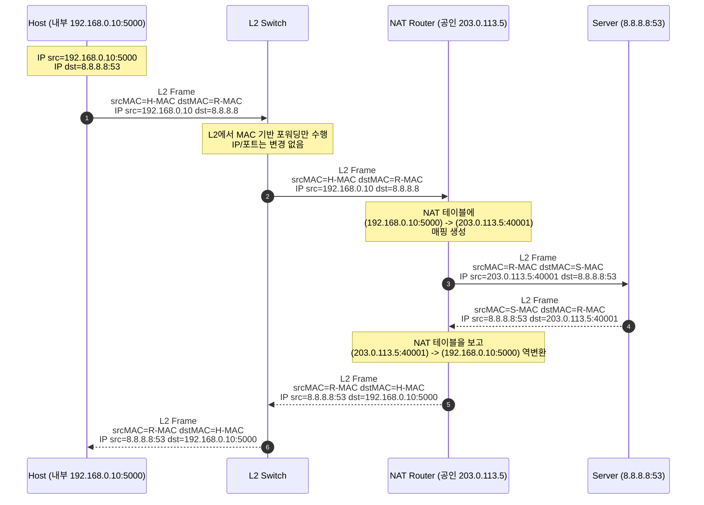
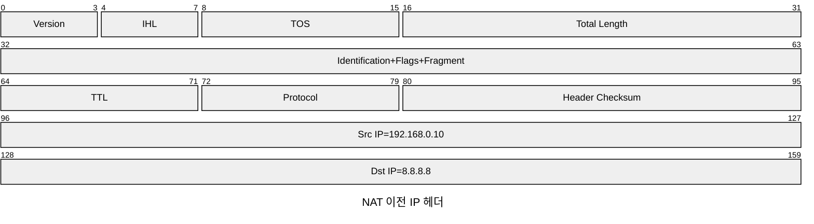
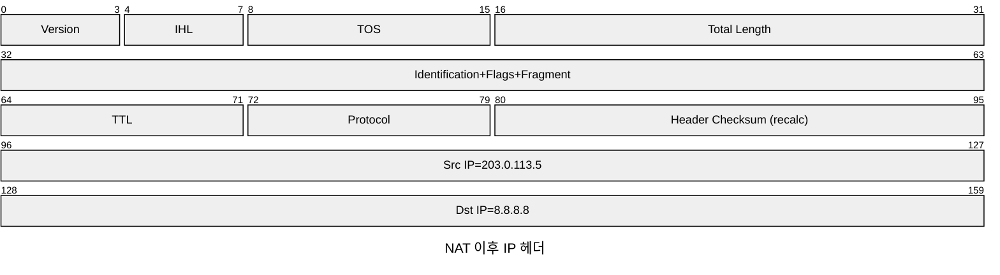

> 이 글은 ft_traceroute 과제에서 VM 네트워크 모드(NAT/Bridged)에 따라 관측이 달라질 수 있는 이유를
> **네트워크 레벨의 개념(레퍼런스)** 으로 정리한 문서이다.
>
> - 관련 글: [ft_traceroute 환경 설정]()

## 용어 미리 정리

- **NAT(Network Address Translation)**: IP 주소(필요 시 포트까지)를 변환해 사설망 ↔ 공인망 간 통신을 중계하는 L3 기능
- **PAT(Port Address Translation)**: 다수의 내부 호스트가 **하나의 공인 IP**를 공유하기 위해 포트까지 함께 변환하는 NAT의 한 형태
- **Bridging(브리징)**: 서로 다른 L2 세그먼트를 하나의 브로드캐스트 도메인처럼 연결하는 방식
- **Bridged Adapter(가상화 용어)**: VM의 가상 NIC를 호스트의 물리 NIC에 L2 수준으로 붙여 VM을 “같은 LAN의 독립 호스트”처럼 보이게 하는 모드

## NAT (Network Address Translation)

NAT란, 라우터가 패킷을 지나가게 하면서 IP 주소를 다른 주소로 바꿔주는 기술로,
IP 주소를 변환해서 프라이빗 네트워크 <-> 외부 네트워크(인터넷)을 중계하는 역할을 한다.

실무/가정 환경에서 말하는 NAT는 대부분 **PAT(NAPT)** 형태로 동작한다.
즉, 내부 호스트 여러 대가 외부에서는 “공인 IP 1개”로 보이며,
각 흐름(flow)은 NAT 장비가 유지하는 상태 테이블에 의해 구분된다.

### OSI 계층 관점

- 위치와 역할

NAT는 네트워크 계층(L3)기능으로 분류되며, 라우터나 L3 스위치에서 동작한다.

IP 헤더의 출발지/목적지 주소를 다른 주소로 매핑하여, 사실 IP <-> 공인 IP 번역을 수행한다.

- 어떤 PDU/필드를 건드리나?

L3 PDU(패킷)의 IP 헤더 필드(src/dest IP)를 수정하고, PAT(Port Address Translation)까지 포함하면 L4 헤더의 포트 번호도 함께 매핑한다.

이 과정에서 연결 상태를 NAT 테이블로 유지하여, 외부에서 돌아오는 패킷을 다시 내부 호스트로 되돌릴 수 있게 한다.

### NAT 상태(state)와 매핑 테이블

NAT 장비는 일반적으로 다음과 같은 키를 기준으로 상태를 유지한다.

- TCP/UDP: `(src ip, src port, dst ip, dst port, protocol)`
- 매핑 결과: `(public ip, public port)`

외부로 나가는 트래픽을 먼저 만들면(내부 → 외부), NAT 테이블에 “역변환 정보”가 생성되어
외부에서 되돌아오는 패킷(외부 → 내부)을 내부 호스트로 전달할 수 있다.

반대로 외부에서 임의로 들어오는 인바운드 트래픽은,
**해당 매핑이 테이블에 없으면 폐기(drop)** 되는 것이 일반적이다.
그래서 VM 환경에서 NAT 모드로 서비스(서버)를 열었을 때 외부에서 접속하려면
대개 **포트포워딩** 같은 별도 설정이 필요하다.

### ICMP와 NAT (관측이 달라질 수 있는 지점)

ICMP는 TCP/UDP처럼 “포트” 개념이 항상 존재하지 않기 때문에 NAT 입장에서는 매핑이 까다롭다.
대표적으로 traceroute/ping 같은 도구는 ICMP 에러 응답을 관측하는데,
NAT 장비(또는 가상화 NAT 엔진)가 이를 어떻게 처리하느냐에 따라 다음 현상이 발생할 수 있다.

- ICMP 응답이 NAT 장비에서 **대리 응답처럼 보이거나**, 혹은
- ICMP가 호스트/NAT 레이어에서 처리되어 VM 내부에서는 **경로가 짧게 관측**될 수 있음

특히 traceroute는 TTL 만료로 인해 발생하는 ICMP Time Exceeded를 기반으로 홉을 추정하므로,
중간에서 ICMP가 변형되거나 차단되면 출력(`* * *`)이 달라질 수 있다.

- NAT 전/후 패킷 헤더 비교

### 가상 머신에서의 NAT

가상머신에서 네트워크 설정을 NAT로 설정하면, VM이 호스트와는 다른 사설 서브넷에 있고, 호스트가 라우터+NAT 역할을 해서 외부 네트워크에 나간다. 

따라서 VM은 인터넷에 나갈 수 있지만, 외부에서 VM으로 직접 접속하기 위해서는 별도 포트포워딩이 필요하다.

> 요약
>
> - NAT 모드: “VM → 인터넷”은 쉽지만, “인터넷 → VM”은 기본적으로 막혀있다고 보는 것이 안전하다.
> - 네트워크 디버깅: VM 내부에서 관측한 traceroute 결과가 실제 경로와 다를 수 있으므로, 캡처로 근거를 확보하는 편이 좋다.

## Bridge / Bridged Adapter

브리징은 L2(이더넷) 레벨에서 프레임을 전달해 두 네트워크를 이어 붙이는 방식이다.
라우팅처럼 “IP 대역을 바꿔가며 전달”하는 것이 아니라,
같은 브로드캐스트 도메인(L2 세그먼트)처럼 동작하도록 만드는 것을 목표로 한다.

### L2 브리지 동작 (스위치와 유사)

브리지는 스위치처럼 MAC 주소 기반으로 포워딩한다.

- 프레임이 들어오면 `src MAC`을 학습(MAC table)
- `dst MAC`을 MAC table에서 찾고,
  - 있으면 해당 포트로 전달
  - 없으면 플러딩(flooding)

이 과정에서 L3 헤더(IP)는 “원칙적으로” 변환하지 않는다.

### 가상화에서의 Bridged Adapter 의미

VirtualBox/VMware 등의 “Bridged Adapter”는 VM의 가상 NIC를 호스트의 물리 NIC에 L2로 붙여서,
VM이 외부 네트워크에서 **독립 장비(독립 MAC)** 처럼 보이게 만든다.

일반적으로 다음 특성이 있다.

- VM이 DHCP로 IP를 받으면, 그 IP는 외부 LAN(호스트가 붙은 네트워크)의 대역을 사용한다.
- NAT처럼 주소 변환이 없어서, traceroute 관측이 “더 실제 경로에 가깝게” 나올 가능성이 높다.

### Bridged에서 흔한 실패 원인(보안/정책)

기관/클러스터 환경에서는 다음 정책 때문에 브릿지 모드가 막힐 수 있다.

- **Port Security / 미인가 MAC 차단**: 스위치 포트가 특정 MAC만 허용
- **802.1X**: 인증되지 않은 단말의 네트워크 접근 제한
- **Promiscuous mode 제한**(가상화 설정/보안 정책): 브리지 구성 시 필요한 프레임 수신이 제한

이 경우 VM 인터페이스가 `NO-CARRIER`로 보이거나, DHCP가 실패하거나, 외부 통신이 불가능해질 수 있다.

## traceroute 관측 관점에서의 정리

- NAT 모드
  - 장점: 외부 인터넷 연결이 안정적
  - 단점: NAT 엔진/정책에 따라 ICMP 관측(홉)이 왜곡되거나 일부가 누락될 수 있음

- Bridged 모드
  - 장점: 주소 변환이 없어서 경로 관측이 실제 환경과 유사해질 가능성이 큼
  - 단점: 기관 네트워크 정책에 의해 차단될 수 있음
