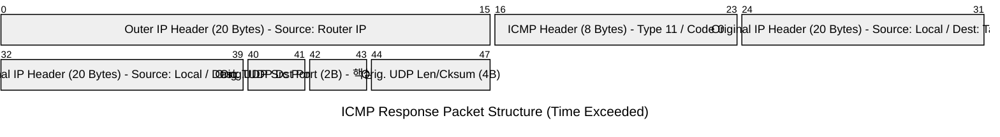

> 이 글은 **개념 파트(패킷 구조)**와 **구현 노트(리팩토링 회고)**로 나뉩니다.
>
> - [Concept: ICMP Time Exceeded 패킷 구조](#concept-icmp-time-exceeded-패킷-구조)
> - [Implementation Notes: inflight 리팩토링 회고](#implementation-notes-inflight-리팩토링-회고)

## Concept: ICMP Time Exceeded 패킷 구조

ICMP Time Exceeded(타입 11) 메시지는 라우팅 과정에서 패킷의 TTL이 0이 되어 폐기되었음을 알리는 ICMP 에러 응답이다.
traceroute는 이 응답을 이용해 각 홉(hop)의 라우터 주소와 왕복 시간(RTT)을 추정한다.

Time Exceeded 응답은 일반적으로 다음 3가지 블록으로 구성된다.

1. **Outer IP Header**: 응답을 보낸 라우터(또는 호스트)의 IP 헤더
2. **ICMP Header**: ICMP 타입/코드 및 체크섬
3. **Original Datagram(원본 데이터그램의 일부)**: 문제를 유발한 원본 패킷의 일부(원본 IP 헤더 + 원본 페이로드 선두)

ICMP Time Exceeded의 주요 필드는 다음과 같다.

- **Type**: `11`
- **Code**
    - `0`: Time-to-live exceeded in transit
    - `1`: Fragment reassembly time exceeded

그리고 “원본 데이터그램의 일부”에는 원본 IP 헤더(최소 20바이트)와 원본 페이로드의 선두 일부가 포함된다.
원본 페이로드는 최소 8바이트가 포함되는 것이 관례이므로(즉, UDP/TCP 헤더의 일부), UDP 기반 traceroute에서는 **원본 UDP 포트 정보를 복원**할 수 있다.


UDP 기반 traceroute 구현에서 Time Exceeded 패킷을 파싱할 때는 다음 정보가 핵심이다.

- Outer IP Header의 **source address**: “이번 응답을 보낸 홉”의 IP
- ICMP Header의 **type/code**: Time Exceeded(11/0)인지, Destination Unreachable(3)인지 구분
- ICMP payload 내부의 원본 IP/UDP 헤더에서 **원본 UDP destination port**: “어떤 프로브(probe)에 대한 응답인지”를 매칭하는 식별자



### 상세 레이어 설명

- Outer IP Header (0~19 바이트)
    - 응답을 보낸 라우터/호스트의 IP 헤더이다.
    - `saddr`(source address)를 통해 홉(hop)의 주소를 확인한다.

- ICMP Header (20~27 바이트)
    - `type=11`(Time Exceeded) 또는 `type=3`(Destination Unreachable) 등을 포함한다.
    - 파싱 시 `type/code`는 후속 처리(홉 진행/종료 판단)의 기준이 된다.

- Original IP Header (ICMP payload 내부)
    - 에러를 유발한 원본 데이터그램의 IP 헤더 복사본이다.
    - `ihl * 4`로 원본 IP 헤더 길이를 계산한 뒤 원본 L4 헤더 위치를 산출한다.

- Original UDP Header (ICMP payload 내부)
    - 원본 데이터그램이 UDP인 경우, 원본 UDP 헤더(최소 8바이트)가 포함된다.
    - traceroute는 보통 프로브마다 destination port를 증가시키므로(예: 33434, 33435, ...),
        이 값은 “응답 ↔ 프로브” 매칭에 사용되는 대표적인 식별자이다.

> 참고: ICMP 에러 메시지에는 “원본 패킷 전체”가 아니라 **원본 IP 헤더 + 원본 페이로드 일부**만 포함된다.
> 따라서 매칭에 필요한 값이 원본 헤더의 앞부분에 있도록(예: UDP 헤더) 설계하는 것이 일반적이다.

---

## Implementation Notes: inflight 리팩토링 회고

아래 내용은 “패킷 구조” 개념을 실제 코드로 옮기는 과정에서 겪었던 시행착오를 정리한 개발 노트입니다.

### 관찰: “왜 Debian에선 한 번에 16개씩 날아가지?”

처음엔 Ubuntu 환경에서 `traceroute`의 동작을 따라 구현했습니다. 체감상은 이런 흐름이었어요.

- 패킷을 **하나 보내고**
- **바로 그 하나의 응답**을 받고
- 다음 패킷을 보내는 느낌

그래서 타임아웃도 “있긴 한데 크게 체감이 안 되는” 정도였습니다.

그런데 Debian에서 실제 `traceroute`를 돌려보니 완전히 달랐습니다.

- 한 번에 **대략 16개 정도**가 inflight(비행 중)로 쌓여 있고
- 응답이 없으면 **약 5초 타임아웃**이 존재

즉 “send → recv → send”가 아니라, **send를 여러 개 해두고** 그 뒤에 **도착하는 응답을 매칭**하는 구조였습니다.

이걸 보고 제 구현도 다음으로 바뀌어야 했습니다.

1) 여러 프로브를 동시에 보내고(inflight 유지)
2) `recv`로 들어오는 응답을 “어떤 프로브의 결과인지” 찾아서 기록
3) 타임아웃이 지나면 그 프로브는 실패로 마감

---

### 첫 설계: MAX_INFLIGHT 큐(FIFO)로 처리하면 되지 않을까?

처음엔 간단하게 생각했습니다.

- 배열 크기: `MAX_INFLIGHT` (예: 16)
- 새로 보낸 패킷은 큐에 push
- 응답을 받으면 큐의 맨 앞(pop)과 매칭해서 처리

그런데 여기엔 치명적인 반례가 있었습니다.

#### 반례: “나중에 보낸 패킷이 먼저 돌아오면?”

예를 들어 이런 상황이 가능합니다.

- TTL=1 프로브: 라우터가 느려서 응답이 늦음
- TTL=5 프로브: 중간 라우터가 즉시 Time Exceeded를 보내서 더 빨리 도착

이때 큐(FIFO)는 **‘맨 앞의 TTL=1’**에 결과를 써야 한다고 가정하지만,
실제로 도착한 건 **TTL=5**에 대한 응답입니다.

즉, “순서대로 도착한다”는 가정을 하는 순간, 결과 저장이 꼬입니다.

---

### 개선 설계: 프로그램이 보낼 수 있는 ‘최대 패킷 수’ 기준으로 테이블 관리

그래서 방향을 바꿨습니다.

- 큐가 아니라 **인덱스로 바로 접근 가능한 테이블**
- 프로그램이 보낼 수 있는 최대 프로브 수는

```
max_slots = max_ttl * probes_per_hop
```

예를 들어 `max_ttl=30`, `probes_per_hop=3` 이면 최대 90개 슬롯이면 됩니다.
각 슬롯에 “언제 보냈는지/TTL은 얼마였는지/응답 상태”를 저장해두면,
응답이 어떤 순서로 오든 **해당 슬롯만 업데이트**하면 되죠.

#### (예시) inflight 슬롯 구조

```c
typedef struct s_probe {
    int      active;
    uint16_t seq;          // 내가 부여한 논리적 시퀀스(0..max_slots-1)
    uint8_t  ttl;
    uint64_t sent_ms;
    double   rtt_ms;
    struct sockaddr_in responder;
} t_probe;

// max_ttl * probes_per_hop 크기로 고정
static t_probe g_probes[MAX_SLOTS];
```

---

### 진짜 문제: “그럼 응답이 왔을 때, 어떤 슬롯인지 뭘로 찾지?”

송신 시점에는 간단했습니다.

- `seq`를 0부터 증가시키고
- `g_probes[seq]`에 저장

그래서 수신할 때도 당연히 이렇게 할 생각이었습니다.

> “ICMP 응답 안에 `icmp.un.echo.sequence`가 있겠지? 그걸 읽어서 인덱스로 쓰면 되겠다.”

그런데 실제로 `icmp.un.echo.sequence`를 찍어보면 **원하지 않는 값**, 특히 **0**이 자주 들어 있었습니다.

여기서 핵심 깨달음이 나왔습니다.

#### ping 과제와 traceroute 과제의 차이

- `ping`: **ICMP Echo Request**를 직접 보냄 → 응답(또는 에러)에 ICMP Echo 관련 필드가 의미 있음
- `traceroute`: 보통 **UDP 패킷**을 보냄 → 돌아오는 건 ICMP Time Exceeded지만,
    그 안에 들어있는 “원본 패킷 헤더”는 **UDP**

즉, traceroute에서 받는 ICMP는 **내가 보낸 ICMP Echo에 대한 응답이 아니라**
**내 UDP 프로브가 TTL로 터졌다는 에러 리포트**였습니다.

그래서 `icmp.un.echo.sequence`가 기대대로 동작하지 않는 게 정상입니다.

---

### 해결: ICMP payload 안의 “Original UDP dst port”로 매칭하기

다행히 ICMP Time Exceeded는 RFC 관례상 다음을 포함합니다.

- 원본 IP 헤더
- 원본 페이로드의 앞부분(최소 8바이트)

UDP의 앞 8바이트는 곧 UDP 헤더이므로,
여기서 **dst port**를 꺼낼 수 있습니다.

그리고 traceroute는 보통 프로브마다 dst port를 증가시키므로(33434+),
이걸 “식별자”로 삼으면 됩니다.

#### (예시) ICMP Time Exceeded에서 원본 UDP dst port 파싱

```c
static int parse_probe_index_from_icmp_time_exceeded(
        const uint8_t *pkt, size_t len,
        uint16_t base_port, int max_slots,
        int *out_index)
{
    if (len < sizeof(struct ip)) return -1;

    const struct ip *outer_ip = (const struct ip *)pkt;
    size_t outer_iphdr_len = outer_ip->ip_hl * 4;
    if (len < outer_iphdr_len + 8) return -1;

    // ICMP header는 outer IP 다음
    const struct icmphdr *icmp = (const struct icmphdr *)(pkt + outer_iphdr_len);
    (void)icmp; // type/code 검사는 호출부에서 해도 됨

    // ICMP payload에는 '원본 IP 헤더'가 들어 있음
    const uint8_t *inner = pkt + outer_iphdr_len + sizeof(struct icmphdr);
    size_t inner_len = len - (outer_iphdr_len + sizeof(struct icmphdr));

    if (inner_len < sizeof(struct ip)) return -1;
    const struct ip *inner_ip = (const struct ip *)inner;
    size_t inner_iphdr_len = inner_ip->ip_hl * 4;
    if (inner_len < inner_iphdr_len + 8) return -1; // UDP header 최소 8바이트

    // inner IP 다음이 원본 UDP header
    const struct udphdr *inner_udp = (const struct udphdr *)(inner + inner_iphdr_len);
    uint16_t dport = ntohs(inner_udp->dest);

    int idx = (int)dport - (int)base_port;
    if (idx < 0 || idx >= max_slots) return -1;

    *out_index = idx;
    return 0;
}
```

이제 수신 루프는 다음처럼 “도착 순서와 무관하게” 정확한 슬롯을 찾을 수 있습니다.

```c
int idx;
if (parse_probe_index_from_icmp_time_exceeded(buf, n, 33434, MAX_SLOTS, &idx) == 0) {
    t_probe *p = &g_probes[idx];
    if (p->active) {
        p->active = 0;
        p->rtt_ms = now_ms() - p->sent_ms;
        // responder 주소 기록 등...
    }
}
```

---

### 정리

이번 리팩토링의 포인트는 “패킷을 순서대로 처리할 수 있을 것”이라는 가정을 깨고,
**inflight를 추적하는 구조로 전환**하는 것이었습니다.

- Debian traceroute처럼 여러 프로브를 동시에 날리면
    응답은 반드시 섞여서 도착합니다
- 따라서 FIFO 큐는 쉽게 깨지고
- 결국 “응답을 식별할 수 있는 키”로 테이블 인덱싱이 필요합니다
- traceroute는 UDP 프로브를 쓰기 때문에 `icmp.un.echo.sequence`가 아니라
    **ICMP payload 내부의 Original UDP dst port**가 그 키가 됩니다

이 문서의 앞부분(패킷 구조)이 그대로 “왜 dst port가 핵심 식별자인가?”에 대한 근거가 되어,
구현이 흔들릴 때마다 다시 돌아와 확인할 수 있는 체크포인트가 됐습니다.