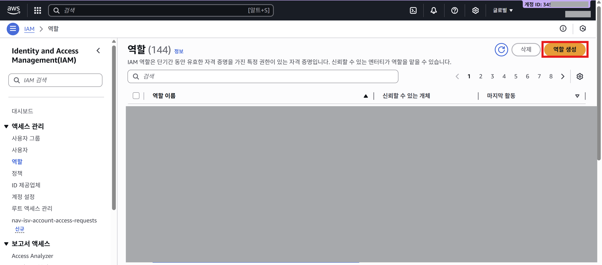
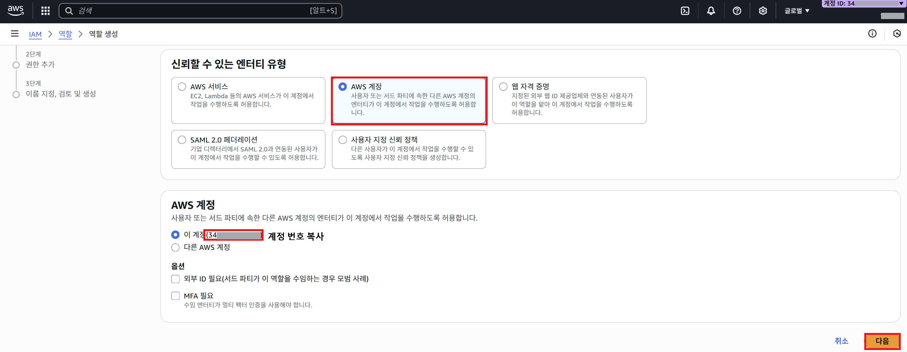

## IAM이란?

AWS IAM(Identity and Access Management)은 AWS 클라우드 리소스에 대한 접근을 안전하게 제어하고 관리하는 서비스이다.
이를 통해 누가(인증), 무엇을(권한), 어떤 조건에서(정책) AWS 리소스에 접근할 수 있는지를 세밀하게 정의할 수 있으며, 사용자(User), 그룹(Group), 역할(Role), 정책(Policy)이라는 네 가지 핵심 개념으로 구성된다.
IAM을 통해 루트 계정의 무분별한 사용을 방지하고, 최소 권한 원칙(Least Privilege)에 따라 각 엔터티에게 필요한 만큼만 권한을 부여함으로써 보안을 강화할 수 있다.

## IAM Role이란? 왜 사용하는가?

### Role의 개념과 User와의 차이

**IAM Role(역할)**은 특정 권한을 가진 AWS 자격 증명으로, 한 사람이나 엔터티에 고정되지 않고 필요한 누구나 일시적으로 '맡을(Assume)' 수 있는 개념이다. 반면 **IAM User(사용자)**는 특정 개인이나 애플리케이션에 고정된 장기 자격 증명(Access Key, Secret Key)을 가지며, 항상 동일한 권한을 유지하는 정적인 존재이다.

핵심 차이점은 다음과 같다:

- **User**: 장기 자격 증명, 특정 개인/앱에 귀속, 고정된 권한
- **Role**: 임시 자격 증명, 신뢰할 수 있는 엔터티가 수임 가능, 동적 권한 부여

### Role을 사용하는 이유

**보안 강화와 최소 권한 원칙**
Role은 임시 보안 자격 증명(Temporary Security Credentials)을 제공하여, 장기 Access Key를 저장하고 관리해야 하는 보안 위험을 제거할 수 있다. 작업이 끝나면 자동으로 권한이 만료되므로, 키 유출이나 무분별한 권한 남용을 방지할 수 있다.

**유연한 권한 관리**
여러 사용자나 서비스가 필요할 때만 동일한 Role을 맡아 작업을 수행할 수 있기에, 개별 사용자마다 권한을 일일이 설정할 필요가 없다. 예를 들어 개발자가 평소에는 제한된 권한만 가지다가, 운영 환경 업데이트가 필요할 때만 관리자 Role로 전환하여 작업 후 다시 원래 권한으로 돌아오는 것이 가능하다.

**교차 계정 접근 및 서비스 간 연동**  
다른 AWS 계정의 리소스에 접근하거나, AWS 서비스(EC2, Lambda 등)가 다른 서비스(S3, DynamoDB 등)에 안전하게 접근할 때 Role을 사용한다. EC2 인스턴스에 Role을 부여하면, 인스턴스 내 애플리케이션이 별도의 Access Key 없이도 AWS 리소스에 접근할 수 있다.

**규정 준수 및 감사**  
임시 자격 증명은 AWS CloudTrail과 통합되어 누가, 언제, 어떤 Role을 맡아 어떤 작업을 수행했는지 상세히 기록되므로, 감사 및 규정 준수 요구사항을 충족할 수 있다.

## Role의 핵심 구성 요소

### 1. 권한 정책 (Permission Policy)

Role이 맡았을 때 어떤 AWS 리소스에 대해 어떤 작업을 수행할 수 있는지를 정의한다. 예를 들어 S3 읽기 권한, DynamoDB 쓰기 권한 등을 명시한다.

### 2. 신뢰 정책 (Trust Policy)

**누가** 이 Role을 맡을 수 있는지를 정의하는 정책입니다. 신뢰 정책에 명시된 Principal(주체)만이 `sts:AssumeRole` API를 통해 Role을 수임할 수 있다. 예를 들어:

```json
{
  "Version": "2012-10-17",
  "Statement": [
    {
      "Effect": "Allow",
      "Principal": {
        "AWS": "arn:aws:iam::123456789012:user/developer"
      },
      "Action": "sts:AssumeRole"
    }
  ]
}
```

위 신뢰 정책은 특정 IAM 사용자 `developer`만이 이 Role을 맡을 수 있도록 허용한다.

### 3. AssumeRole 메커니즘

Role을 실제로 사용하려면 `sts:AssumeRole` API를 호출하여 임시 자격 증명(AccessKeyId, SecretAccessKey, SessionToken)을 발급받아야 한다. 이 임시 자격 증명은 기본 1시간(최대 12시간까지 설정 가능) 동안 유효하며, 만료되면 재발급 해야한다.

## IAM Role 사용법

### 1. Role 생성

**AWS 콘솔에서 생성**

1. IAM 콘솔 → 역할 → 역할 생성
   
2. 신뢰할 수 있는 엔터티 선택 (AWS 계정, AWS 서비스, 외부 IdP 등)
   
3. 권한 정책 추가 (예: AmplifyBackendDeployFullAccess)
   
4. Role 이름 지정 후 생성
   
5. 생성 후 Role의 ARN 저장
   

**AWS CLI로 생성**

```bash
aws iam create-role \
  --role-name seed-role \
  --assume-role-policy-document file://trust-policy.json
```

```json
// trust-policy.json
{
  "Version": "2012-10-17",
  "Statement": [
    {
      "Effect": "Allow",
      "Principal": {
        "AWS": "arn:aws:iam::<계정 번호>:user/myuser"
      },
      "Action": "sts:AssumeRole"
    }
  ]
}
```

### 2. Assume 정책 구성 및 사용자에게 AssumeRole 권한 부여

Role을 만든 후, IAM 사용자에게 해당 Role을 맡을 수 있는 권한을 부여해야 한다.
이를 위해 sts:AssumeRole을 포함하는 정책을 하나 구성해야한다.

1. IAM 콘솔 → 정책 → 정책 생성
   
2. 시각적 편집기 → 서비스 선택(`STS`) → 쓰기(AssumeRole) 추가
   
3. ARN 추가 후 위에서 저장했던 Role의 ARN을 추가한다.
   
4. 정책 이름 추가 후 정책 생성 및 사용자애게 해당 권한 추가 (직접 정책 연결 -> 고객 관리형 필터링)
   

```json
// 생성된 정책 예시
{
  "Version": "2012-10-17",
  "Statement": [
    {
      "Effect": "Allow",
      "Action": "sts:AssumeRole",
      "Resource": "arn:aws:iam::<계정 번호>:role/<역할 이름>"
    }
  ]
}
```

### 3. Role 수임 (AssumeRole) 및 임시 자격 증명 사용

CLI에서 해당 역할로 작업을 수행하기 위해서는 아래의 절차를 따른다.

- 콘솔에서는 상단 위 **역할 전환**을 통해 역할을 전환할 수 있다.
  

**AWS CLI로 Role 수임**

```bash
aws sts assume-role \
  --role-arn arn:aws:iam::<계정 번호>:role/<역할 이름> \
  --role-session-name my-session
```

반환되는 JSON에서 AccessKeyId, SecretAccessKey, SessionToken을 추출합니다.

**환경 변수로 임시 자격 증명 등록**

```bash
export AWS_ACCESS_KEY_ID=<AccessKeyId>
export AWS_SECRET_ACCESS_KEY=<SecretAccessKey>
export AWS_SESSION_TOKEN=<SessionToken>
```

이후 AWS CLI나 SDK를 실행하면 해당 Role의 권한으로 작업이 수행된다.

### 4. 자동화 스크립트 예시

매번 수동으로 임시 자격 증명을 발급받고 환경 변수를 설정하는 것은 번거롭기 때문에 아래 스크립트를 활용하여 자동화 할 수 있다.

```bash
#!/bin/bash
ROLE_ARN="arn:aws:iam::<계정 번호>:role/seed-role"
SESSION_NAME="my-session"

# AssumeRole 실행 및 임시 자격 증명 추출
ASSUME=$(aws sts assume-role \
  --role-arn $ROLE_ARN \
  --role-session-name $SESSION_NAME \
  --query 'Credentials.[AccessKeyId,SecretAccessKey,SessionToken]' \
  --output text)

# 환경 변수 자동 등록
export AWS_ACCESS_KEY_ID=$(echo $ASSUME | awk '{print $1}')
export AWS_SECRET_ACCESS_KEY=$(echo $ASSUME | awk '{print $2}')
export AWS_SESSION_TOKEN=$(echo $ASSUME | awk '{print $3}')

# AWS 작업 실행 (예: Amplify seed)
amplify sandbox seed
```

---

### 정리

AWS IAM Role은 AWS 보안과 권한 관리의 핵심 도구이며 임시 자격 증명을 통한 동적 권한 부여, 교차 계정 접근, 서비스 간 안전한 연동 등 다양한 시나리오에서 최소 권한 원칙을 구현할 수 있다. 초기에는 AssumeRole과 임시 자격 증명 관리가 다소 번거로울 수 있지만, 스크립트 자동화와 AWS SSO 등의 도구를 활용하면 생산성과 보안을 동시에 확보할 수 있다.

---

**참고자료**
[IAM 역할(Role)과 Switch](https://whchoi98.gitbook.io/aws-iam/iam-role)
[What is IAM?](https://docs.aws.amazon.com/IAM/latest/UserGuide/introduction.html)
[IAM 역할](https://docs.aws.amazon.com/ko_kr/IAM/latest/UserGuide/id_roles.html)
[왜 IAM을 사용해야 하나요?](https://docs.aws.amazon.com/ko_kr/IAM/latest/UserGuide/intro-iam-features.html)
[AWS 공식 IAM 역할 관리 가이드](https://aws.amazon.com/ko/iam/details/manage-roles/)
[Somaz IT – Assume Role 실전 및 사용법](https://somaz.tistory.com/337)
[IAM의 보안 모범 사례](https://docs.aws.amazon.com/ko_kr/IAM/latest/UserGuide/best-practices.html)
