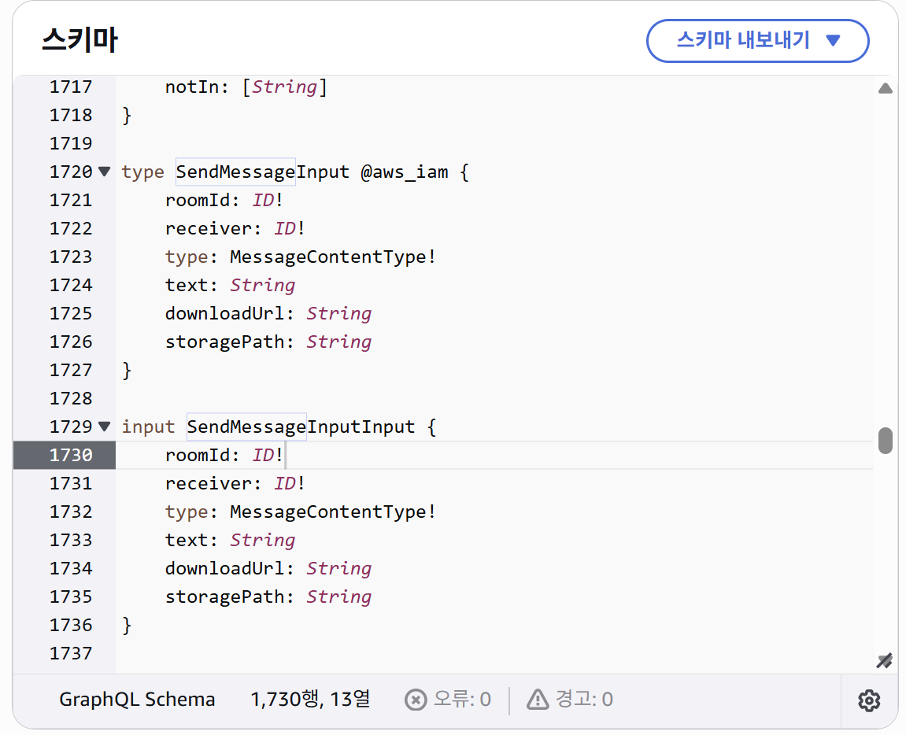

### GraphQL Input 타입 오류(NonInputTypeOnVariable)

**오류 메세지**

```bash
Validation error of type NonInputTypeOnVariable: Wrong type for a variable
```

**문제 상황**
프론트에서 다음과 같은 mutation 쿼리문을 작성했는데, 위와 같은 오류가 발생했다.

```dart
// 실제 요청
final request = GraphQLRequest<ChatMessage>(
    document: '''
        mutation SendMessage(\$input: SendMessageInputInput!) {
        sendMessage(input: \$input) {
            id
            receiver
            sentFrom
            content {
            messageId
            type
            text
            downloadUrl
            storagePath
            }
            createdAt
            updatedAt
        }
        }
        ''',
    variables: {'input': input},
    modelType: ChatMessage.classType,
    decodePath: "sendMessage",
    );
```

이때의 스키마 정의는 아래와 같이 하였다.

```ts
// Amplify Data 정의 스키마
SendMessageInput: a.customType({
        roomId: a.id().required(),
        receiver: a.id().required(),
        type: a.ref("MessageContentType").required(),
        text: a.string(),
        downloadUrl: a.string(),
        storagePath: a.string(),
    }),
sendMessage: a
    .mutation()
    .arguments({ input: a.ref("SendMessageInput").required() })
    .returns(a.ref("ChatMessage"))
    .handler(a.handler.function(sendMessageFn))
    .authorization((allow) => [allow.authenticated()]),
```

당연히 `SendMessageInput` 타입을 명시하면 정상동작 할줄 알았으나,

- 실제 생성된 GraphQL 스키마
  

해당 오류가 계속 발생하여 실제 생성된 스키마를 살펴보니 `SendMessageInput`은 `type`으로 정의된다.
하지만, GraphQL 스펙에서 mutation 변수 타입은 반드시 `input`타입이어야 한다.

**해결**
GraphQL 변수 타입에 `SendMessageInputInput`을 사용

혹은 변수를 나열하여 사용

```dart
final request = GraphQLRequest<ChatMessage>(
    document: '''mutation SendMessage(
        $roomId: ID!,
        $receiver: ID!,
        $type: MessageContentType!,
        $text: String,
        $downloadUrl: String,
        $storagePath: String
    ) {
        sendMessage(
            input: {
                roomId: $roomId,
                receiver: $receiver,
                type: $type,
                text: $text,
                downloadUrl: $downloadUrl,
                storagePath: $storagePath
            }
        ) {
            id
            receiver
            sentFrom
            content {
            messageId
            type
            text
            downloadUrl
            storagePath
            }
            createdAt
            updatedAt
        }
        }''',
    variables: {
        'roomId': input['roomId'],
        'receiver': input['receiver'],
        'type': input['type'],
        'text': input['text'],
        'downloadUrl': input['downloadUrl'],
        'storagePath': input['storagePath'],
    },
    modelType: ChatMessage.classType,
    decodePath: "sendMessage",
);
```

---

### Amplify update 요청 시 Unauthorized on [owner] 오류

Amplify API가 제공해주는 ModelMutation.update() 메소드를 이용하여 메시지 수정(Update)을 구현하면서 다음과 같은 오류가 발생했다.

**오류 메시지**

```bash
Update text failed: Unauthorized on [owner]
```

**문제 상황**

아래 메소드로 생성된 request는 다음과 같았다.

```dart
final request = ModelMutations.update(newMessageContent);
```

```graphql
document: '''
    mutation updateMessageContent($input: UpdateMessageContentInput!, $condition: ModelChatMessageConditionInput) {
        updateMessageContent(input: $input, condition: $condition) {
            messageId
            type
            text
            ...
            createdAt
            updatedAt
            owner
        }
    }''',
variables: {
    input: {
        messageId: db754193-d616-43ee-8ffb-e835f42514a1,
        type: TEXT
        text: "Modified",
        ...
        createdAt: 2025-11-23T13:56:47.470Z,
        updatedAt: 2025-11-23T13:56:47.470Z,
        owner: null
    },
}
```

이때 Amplify의 `ModelMutations.update()`는 모델의 모든 필드 값을 자동으로 `UpdateChatMessageInput`에 포함시켰고, 그 안에는 `owner` 필드도 포함된다.

그런데 `ChatMessage` 스키마에서 `owner` 필드는 보안상의 위험을 제거하기 위해 다음과 같이 설계해놓은 것이 문제가 되었다.

> owner 필드에 쓰기 권한을 주면 해당 레코드의 소유자가 다른 사람의 UUID로 바뀔 수 있어 보안상 문제가 될 수 있다고 한다.

```ts
owner: a.string().authorization(
    (allow) => allow.owner().to(["read"]) // read only
),
```

GraphQL/AppSync는 null이라도 필드를 포함한 순간 그 필드를 업데이트하려는 시도라고 해석한다.

그래서 서버(AppSync)는 owner 필드에 쓰기 작업을 수행하게 되어 **Unauthorized on [owner]** 오류가 발생했다.

즉, 이 문제는 ModelMutations.update가 자동으로 owner 필드를 input에 포함시킨 것과 owner 필드의 read-only 정책이 충돌한 결과다.

**해결 방법**

owner를 보안상 수정 불가능하게 유지하고 싶다면, update mutation을 직접 작성하고 input에서 owner 필드를 제거해야 한다.

```graphql
document: '''
    mutation updateMessageContent(\$messageId: ID!, \$text: String!) {
        updateMessageContent(input: {messageId: \$messageId, text: \$text}) {
        messageId
        type
        text
        }
    }''',
variables: {'messageId': messageId, 'text': toEdit},
modelType: MessageContent.classType,
decodePath: "updateMessageContent",
```
